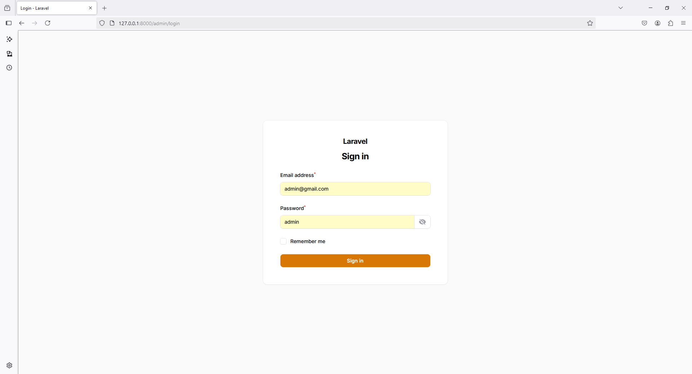
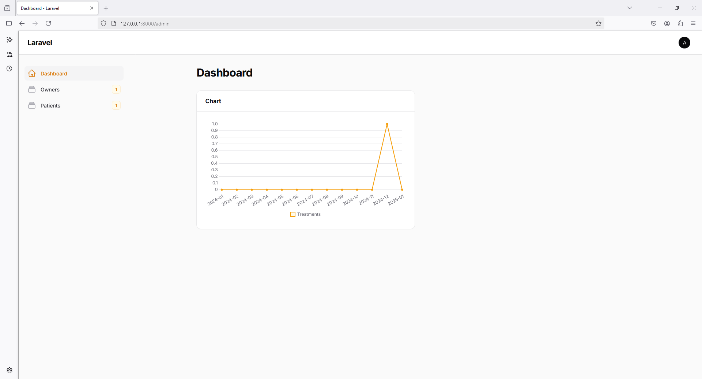
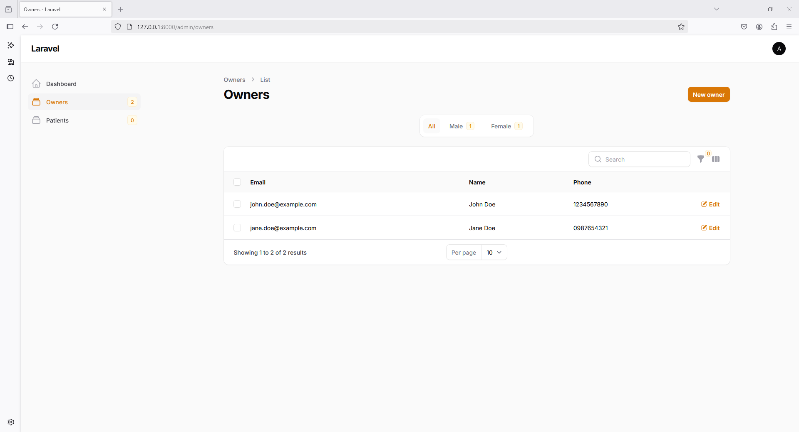
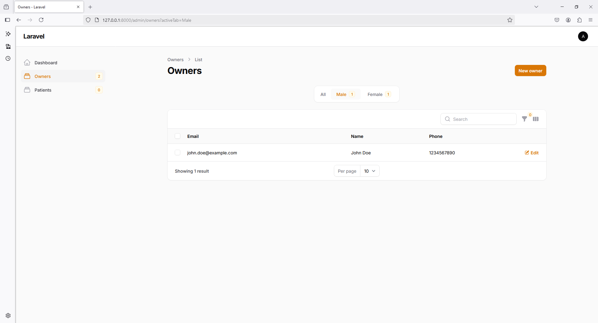
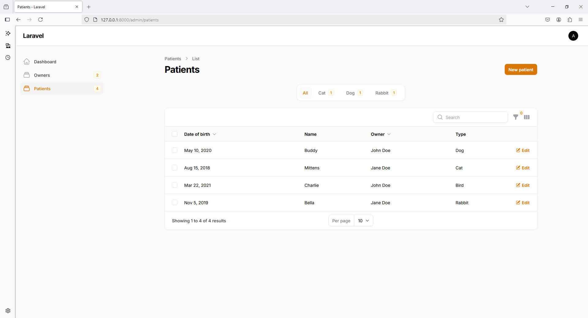
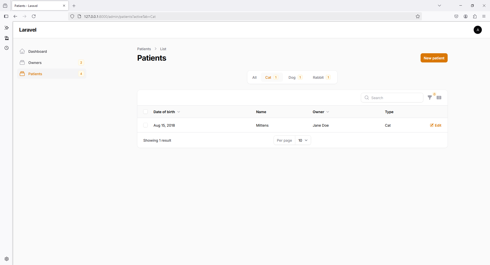
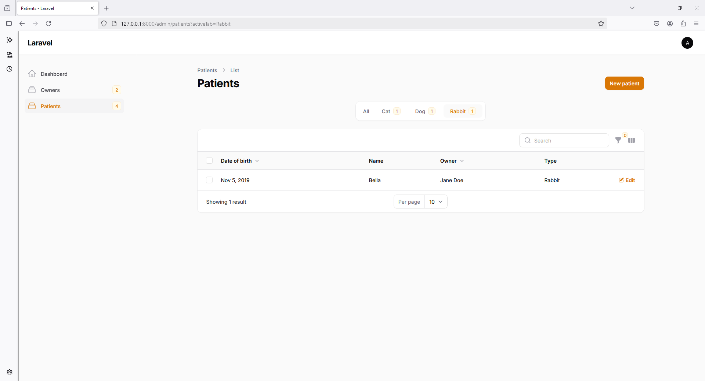

# laravel_pet_clinic_patient_management_system

```
laravel new laravel_pet_clinic_patient_management_system
```

```
cd laravel_pet_clinic_patient_management_system
```

```
php artisan serve
```

```
php artisan make:model Owner -m
```

```
php artisan make:model Patient -m
```

```
php artisan make:model Treatment -m
```

Filament

```
composer require filament/filament:"^3.2" -W
``` 

```
php artisan filament:install --panels
```

```
php artisan make:filament-user
```

```
php artisan make:filament-resource Owner --generate
```

```
php artisan make:filament-resource Patient --generate
```


```
php artisan make:filament-relation-manager PatientResource treatments description
```

```
php artisan make:cast MoneyCast
```

Creating a chart widget

```
composer require flowframe/laravel-trend
```

```
php artisan make:filament-widget TreatmentsChart --chart
```
 














